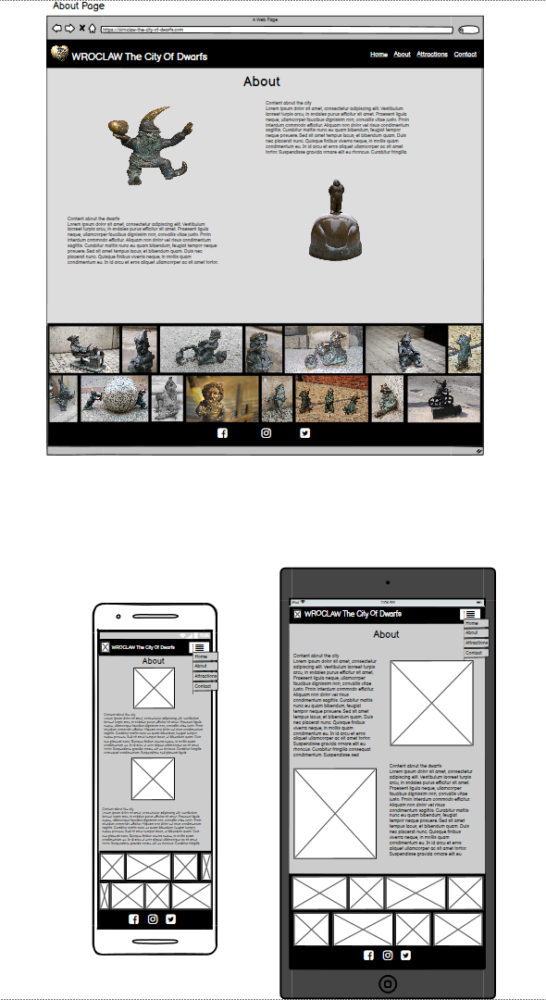
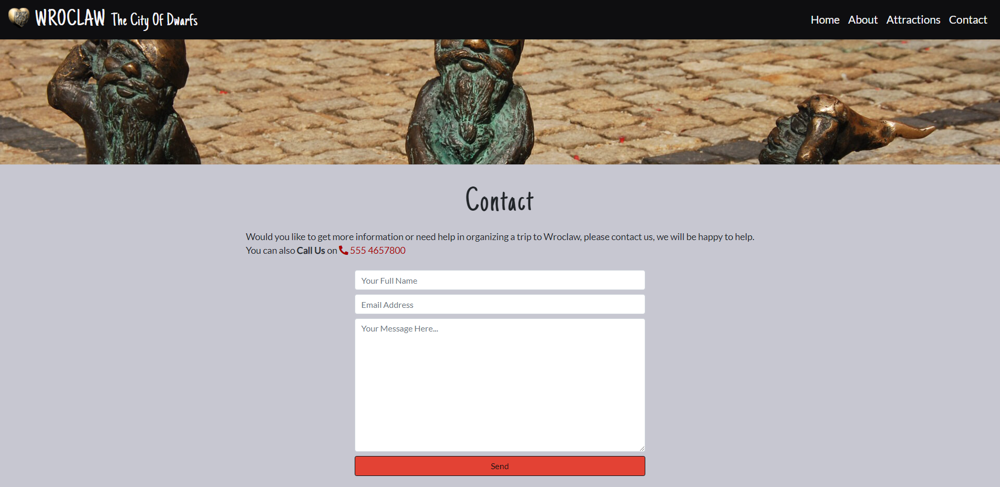

##  WROCLAW The City Of Dwarfs

- [Overview](#overview)
- [User stories](#user-stories)
- [UX](#ux)
- [Features](#features)
- [Technologies used](#technologies-used)
- [Resources](#resources)
- [Testing](#testing)
- [Code validity](#code-validity)
- [Version Control](#version-control)
- [Deployment](#deployment)
- [Credits](#credits)
- [Acknowledgments](#acknowledgments)

## Demo
---

A live demo can be found [here](https://https://github.com/Eva-Kuk/Wroclaw-The-City-Of-Dwarfs-MS2/)

## Overview
---
- This is my second Milestone 2 project which is part of the Code Isntitute's FullStack Software Development Diploma Course.
 This project demonstrates the skills and knowledge of using the HTML5, CSS, Javascript and API with an additional framework
  Bootstrap in Interactive frontend Development module which I have learned recently on the course.
- Wrocław the city of dwarfs is an interactive guide of a Polish city located in the south-west of Poland. 
The aim of this guide-website is to present the tourist attractions, including the small Wroclaw dwarfs that have settled in this city for good, 
as well as the accommodation and gastromomy facilities offered by the city. This website was created to encourage everyone to visit this 
beautiful city and enjoy its charms.

## User stories
---
1. As a user, I want to navigate the site easily, so that I can find what I need effectively.
2. As a user, I want to be able to acces the website on a desktop and also mobile devices, so that I won't be restricted from which device I can access the site. 
3. As a user, I want to be able to follow or connect with the owner of the website on social media, so I can get more information about the city.
4. As a user, I would like to know what the city has to offer, so that I can adjust it to my needs and interests.
5. As a user, I want to have an access to the map of the city with various places, so I can visually see their location.   
6. As a user, I want to be able to contact the site owner, so I will be able to share my feetback regardling the website or ask about planning my visit and get some more advice and recomendations.
7. As a user, I want to easily understand the purpose of this site.

## UX
---
This website design will target tourists of all ages, families with children and friends who are looking for the next city break destination,
 as those intedend to visit Poland. The main purpose of this project was to create and interactive guide website with easy and quick access to
 information about the city by prezenting main attractions, accomodation and gastronomy facilities, displayed on the map, where visitors can search 
 the options of their interest. It will present the main attractions of Wroclaw, the family of small dwarfs that have settled in Wroclaw for good.
 It can be a great activity not only for children but also for adults who may want to find them all while exploring this amazing city.

**1. Strategy**

My goal for this project is to promote the Wroclaw as the next city break destination and increase the interest of tourist activity.
 It is intended to be used as an interactive guide to help navigate through the attractions, restaurants, pubs, accomodation through 
 the UX simple, clean and user-friendly site design. 
 
### Project purpose:
- To create easier trip planning to Wroclaw , by providing useful and helpfull information about the city.
- To promote places which are great for short term destination but may not always be concidered.

### Site owner goals:
- Promote Wroclaw and encourage tourists to visit and explore this lovely city.
- Provide a usefull information about the city and demonstrate various activities, accomodation, and places to eat 
  which may suit the visitors needs and budget. 
- Provide the contact form, so the users be able to get in touch with their queries in relation to their trip.
- Include user friendly map with various attractions, accomodations and gastronomy facilities.
- Include current information about the weather.

### Customer Goals:
- Easy to find informations about attractions , accomodation, and gastronomy facilities of the city.
- Designed with priority of mobile devices as this it the most common way of searching for information.
- Easy to find links to social media accounts to follow the news about the city.
- Easy to find contact form for possible enquiries about the city.

**2. Scope**
- Mobile-first website that is responsive on all devices.
- An Attractions section that includes best attractions, accomodations, gastronomy and dwarf's locations with interactive map.
- Selection of various APIs to display information to the user in real time.
- To ensure that the site immediately shows its purpose.
- To have a straight forward interface, that allows the user to make choices about the content they wish to display.
- Animated small gallery.
- Interactive clickable features that allow the user to find relevant information.
- Provides users with pure UX.
- A contact page that includes an easy to use form that sends emails to an account using EmailJS.
- Fits with my current skills.

**3. Structure**
- The purpose of the Structure has been created as a single page website containing sections for each page and enables users to quickly navigate through the website, 
easily assimilate useful information and have an overview of the attractions, accommodation, facilities.
- The first page will consist of a large hero image amd an animated welcome sign will appear after loading page and also navigation bar which is transparent will change
 to dark after scroll so the user can see the full image first.
- The second about page will contain information about the city, the story about the dwarf and also useful information about the Polish currency and the current weather 
in Poland. At the end of the page there will be an interactive gallery of dwarf's.
- The third Attractions page will contain an interactive map that will be combined with buttons include the most important attractions, places to stay, restaurants 
and the location of some dwarfs in the city.
- A form will be added to the Contact page with the following fields: "Full Name", "Email Address" and "Your Message" which will be required in order to submit the form,
 "Email" input must be the valid format. User is alerted of correct input if data is invalid.
- The user will be able to send an email with enquiry about the city via EmailJS. A confirmation message will appear when email is sent successfully or error message if unsuccesful. 
- The user will be able to interact with the data on the About page by flipping the coins to see its heads or tails.

**4. Skeleton**
## Wireframe mockups:
**HOME PAGE**

 ** HOME PAGE FINAL RESULT**

The navigation bar was initially set to be transparent. While scrolling down it suposed to turn black however, during the development
of the project I decided to keep it black at all times as transparent text was not sufficiently visible on the background image.
The welcome sign initially set as hidden and which appears after the page load and disappears after scrolling down, is now set as permanent.
 I believe it's less distracting for the user.

**ABOUT PAGE**

**ABOUT PAGE FINAL RESULT**

Initially, in the about section, there suposed to be a curency showing images with Polish coins,
which would change to tails after pressing the button, however I decided against it.
I also decided to move the weather to home page and have it as current one day weather.

**ATTRACTIONS PAGE**

**CONTACT PAGE**

- Pages/Section: Home, About, Attractions, Contact
- Fixed footer hiding on with Social Media icons oppened in a new tab.
- Fixed navigation bar primary transparent changes to Ritch Black  as the user starts to scroll down the page 
- Menu headings and pointing to each of the 4 Pages

**5. Surface**
**Colors**
- When choosing the colors, I wanted to refer to the national white and red Polish flag. Cinnabar is the current 
color of the flag and to which I have chosen a slightly more subdued shade of white and complemented it with 
shades of black and gray, which will give a website a balanced contrast. 
- As a primary color, I have chosen the color Ritch Black FORGA 39 (0E0E10) which has some small tonal 
changes from a normal black color and it will be used for navigation bar, footer and font-color of the website. 
- As an additional color, I have chosen Cinnabar (E34234) which will be used for buttons and ON/OFF Switch 
used for reversing buttons. This color will emphasise the important buttons for contact/sentand and they will be noticed by the user immediately.
- For the background I have chosen a Lavender Gray (C7C7D1) and for text on navbar and footer 
I have chosen off-white named Cultured (F4F4F6). Both colors belong to the same color palette as 
Ritch Black FORGA 39. These colors work very well also with the images.

  
 

 **Typography**
- For the main headings, logo "WROCLAW" and the sign "The city of Dwarfs" I selected the "Just Another Hand" 
font with the group of fall-back font of "Cursive". It will add simplicity to the website which I feel suits the overall look of the website. 
I have chosen the same font to make the favicon logo for the tab.
- For the content I have chosen "Lato" with fallback of "sans-serif", which was created by a polish designer 
and due to it's populatity this is a font that many users will be familiar with. It evokes a feeling of trust 
as well as being visually pleasing. It is a popular pairing font with "Just Another Hand"
 according to [google fonts](https://fonts.google.com/specimen/Just+Another+Hand?query=just+&preview.text=WROCLAW%20The%20City%20Of%20Dwarfs&preview.text_type=custom#pairings/)

 **Images**
- The image selection has been chosen very carefuly to present the beauty of Wroclaw city and its main attraction - the Dwarfs which settled in there for good. The photos presentation shows potential tourists the attractiveness of the city
- The hero image was chosen to give the site a little bit fairy-tale character as the main attractions of this city are in fact dwarfs and overall fairy-tale scenery.

## Features
---
**Existing Features**
- It is a fully responsive website hat allows the user to use it on any device
- Designed with HTML, CSS, Java Script and Bootstrap.
- One page with 4 sections acting as individual pages.

#### Navigation bar:
- The fixed navigation which is transparent when the page is loaded and changes to a shade of black on scroll, 
allows user to easily navigate, regardless of which page is visited and also gives a nice effect.
 Navigation bar was changed through the project development and kept black as transparent wasn't visible on the background image as expected.
- The name of the site provides a link to the home page.
- The navigation links reference each section of the site.
- The navigation links are shown in a burger menu on screen of tablet devices size and under.

#### Footer:
- Show/Hide footer when scrolling up or down easily to access social media but also gives a bigger surface on the screen for the user. 
- The footer contains links to social media pages and each opens in a new window.
- The icons change from white to red which refers to the Polish flag.

#### Home Page:
- A background hero-image presented to the user takes 100% of the screen
- A welcome sign appears in the middle of the website after the website is loaded.
- An API weather on the left top corner which shows the current temperature in Wroclaw

#### About Page:
- An interactive gallery moving from side to side,
- The set of coins has On/Off switch which user can reverse to see heads and tails (unfortunately, I couold not apply this idea as available images with coins were not of a suitable quality).
- Three days weather option was changed to one day weather and moved to home page

#### Attractions Page:
- The markers with Attractions, Accommodations, Restaurants/Bubs/Bars and Dwarf's are visible on Google interactive map and each option shows a brief description when clicked.
- The buttons with 4 options to chose from change color from red to white when hovered over and stay white when visited.

#### Contact Page
- A contact form with message space and send button is displayed for potential enquiries.
- Contact phone number is also provided in case the user prefers to make a call.
- A send button chenges from red to white when hovered over, referenced to the polish flag colours.

### HOME PAGE

 
 ### ABOUT PAGE

### ATTRACTIONS PAGE 

### CONTACT PAGE 

**Features Left to Implement when skills develop**
Another feature idea
- The set of coins has On/Off switch which user cane reverse to see heads and tails
- An curency options for the user so they can check and calulate their actual curency.
- Skyskanner API for displaying flights from different locations which wil consist an information od destinations, aerline and price.
- An event calendar section.
- Connect the contact form with backend server.
---

## Technologies Used

**1. Languages**
- [HTML5](https://en.wikipedia.org/wiki/HTML5) - the current standard that is used
- [CSS3](https://en.wikipedia.org/wiki/CSS) - the current standard that is used
- [CSS3](https://en.wikipedia.org/wiki/JavaScript) - the current standard that is used
- [JavaScript](https://en.wikipedia.org/wiki/JavaScript)

**2. Integrations**
- [Bootstrap](https://getbootstrap.com/) - by linking via Bootstrap CDN to HTML Doc making the design responsive. 
- [Font Awesome](https://fontawesome.com/) - Icons for Social Media links in Footer and Tours section
- [Google Fonts](https://fonts.google.com/) - to import typography of the website into the stylesheet file.
- [Google Developers Console](https://console.cloud.google.com/apis/dashboard?project=erudite-cycle-307422&folder=&organizationId=) to get the APIs used on the site.
- [EmailJS](https://www.emailjs.com/) - Java script code given to make Contact Form functional 
- [Latlong.net](https://www.latlong.net/) to find the latitude and longtitude for Poland, Wroclaw and some markers for the map

**3. API**

This site uses following APIs:

1.  [Google Maps JavaScript API](https://developers.google.com/maps/documentation/places/web-service/overview) used to create the map
    - Initially, the map displays the locations of Poland and a marker that shows the locations of Wrocław city
       when hovering over it the name of Wroclaw appears.
    - Next to the map there are buttons which contain places assosiated to Attractions, Food&Drinks, Accomodation and Dwarf Hunting. 
      When buttons are pressed the locations will be given on the map. The markers are clustered together. When the user presses the clusters they will zooms in.
    - Each place has a short description and a name that the user can navigate by clicking on them one after another.
2.  [Open Weather Map](https://openweathermap.org/) for the current weather for the day uses open weather map API. 
3.  [EmailJS](https://dashboard.emailjs.com/sign-in) used to allow the user to send a message via the contact form.

**4. Workspace, version control and Repository storage**
- [GitPod](https://github.com/mkuti/corklagos-venture/blob/master/gitpod.io)- Main workspace IDE (Integrated Development Environment)
- [Git](https://git-scm.com/) - Distributed Version Control tool to store versions of files and track changes.
- [GitHub](https://github.com/) - A cloud-based hosting service to manage my Git repositories.
  
**5. Other**
- [Photoshop](https://www.photoshop.com/en) - for photo editing

**5. IDE Extensions used in GitPod**
- Auto Close Tag
- Bootstrap 5 CDN Snippet (!bcdncss)
- Prettier - Code Formatter
- Bracket Pair Colorizer
- Code spell Checker
- FontAwesome Auto-complete

---
## Resources
- [Code Institute Course Content](https://courses.codeinstitute.net/login) -Main source of fundamental knowledge.
- Code Institute SLACK Community - Source of assistance.
- [Balsamic](https://balsamiq.com/wireframes/) - Wireframing design tool to create wireframes.
- [Responsinator](http://www.responsinator.com/) - Responsive website mockup image generator.
- [Am I Responsive?](http://ami.responsivedesign.is/) - used to check how the website will look on different devices.
- [Autoprefixer](https://autoprefixer.github.io/) - used to add vendor prefixes.
- [Balsamiq Wireframe](https://balsamiq.com/wireframes/) - used to create wireframes for planning project structure and layout.
- [Gooogle chrome developper tools](https://developer.chrome.com/docs/devtools/) - used to check page elements, help debug issues with the site layout and test different CSS styles and console JS.
- [w3schools](https://www.w3schools.com/) - used as general source of knowledge.
- [Stack Overflow](https://stackoverflow.com/) - used as general source of knowledge.
- [Stock Free Images](https://www.stockfreeimages.com/87864301/Papa-Krasnal-gnome.html) resourse for images (papa dwarf). 
- [Tripadvisor](https://www.tripadvisor.ie/) - resourse for Accomodation and FOOD and Drinks in Attractions section.
- [google.com/travel](https://www.google.com/travel/hotels/Wroc%C5%82aw) - resourse for Attractions section.
- [Podroze po europie](https://www.podrozepoeuropie.pl/ostrow-tumski-wroclaw/) - polish website tor the information about the attractions in the city.
- [Wikipedia](https://en.wikipedia.org) - resourse for information about the attractions in Wroclaw .
- [Wikipedia/dwarfs](https://pl.wikipedia.org/wiki/Wroc%C5%82awskie_krasnale) - resourse about dwarfs localizations.
- [Visit Wroclaw](https://visitwroclaw.eu/en) - polish website for the attracion secion content.
- [Kolejkowo ](https://kolejkowo.pl/) - polish website for the attracion section.
- [Colors](https://coolors.co/) - color schemes generator.
- [Contrasr checker](https://webaim.org/resources/contrastchecker/) -contrast color checker.
- [TinyPNG](https://tinypng.com/) - Efficient compression of images for site.
- [Favicon.io](https://www.favicon.io/) -  to convert an image into a favicon.
- [Grammarly](https://www.grammarly.com/) - used to help with grammar check.
- [youtube](https://www.youtube.com/) - used for general resourse.

---
## Testing
- Click [here](TESTING.md) for the full testing process.

Overview
- [Encountered Issues](TESTING.md#encounteredissues)
- [Code Validation](TESTING.md#code-validation)
- [Testing User stories](TESTING.md#testing-user-stories)
- [Testing Functionality](TESTING.md#testing-functionality)
- [Testing Compatibility](TESTING.md#testing-compatibility)
- [Testing Accessibility](TESTING.md#testing-accessibility)
- [Testing Performance](TESTING.md#testing-performance)
- [Further Testing](TESTING.md#further-testing)

---
## Code validity
- HTML - [Markup Validation W3C Service](https://validator.w3.org/)
- CSS - [Jigsaw  Validation W3C Service](https://jigsaw.w3.org/css-validator/)
- JSHint - [JSHint for detecting errors in JavaScript code](https://jshint.com/)
- JS Lint - [JavaScript checking](https://jslint.com/)
- Link checker - [Check links and anchors in Web pages or full Web sites](https://validator.w3.org/checklink)
- Lighthouse in Google dev tool for testing the performance of the website
---

## Version Control
- Used Git for version control.
---

## Deployment

 ### **GitHub Pages**

This project has been deployed on GitHub Page. To deploy it, follow the steps:
- All code was written on Gitpod, an online IDE.
- The code was then pushed to GitHub where it is stored in my [Repository](https://github.com/Eva-Kuk/Wroclaw-The-City-OfDwarfs-MS2).
- At the top of the Repository, click on the "Settings" Button on the menu.
- Scroll down the Settings page and find the "GitHub Pages" Section.
- Under "Source"click on the drop-down, and select the "Master" branch.
- Once selected, this publishes the project to GitHub Pages and displays the site's url.
- There is no difference between the deployed version and the development version.
- There are two APIs used in this project. The API key is a unique identifier that authenticates requests associated with your project.
    Both Api require their own unique key to run the project locally.

####  To create an API key in Google map API:
   You will need your gmail account then you have to create a billing account at [developers.google.com](https://developers.google.com/maps/gmp-get-started).
  1. Go to the APIs & Services > Credentials page [developers.google.com](https://developers.google.com/maps/documentation/javascript/get-api-key) and get your own account and your own key.
  3. On the Credentials page, click Create credentials > API key. The API key created dialog displays your created API key.
  4. Click Close. The new API key is listed on the Credential page. Remember to restrict the API key before using it in projects.
  
 #### To create weather API key 
  Second API is the open weather API key.To create that key you need to go to the [openweathermap.org](https://openweathermap.org/api).
 - Sign up to the account.
 - You will receive your API key when you signed up to the account.
 - Setting up an account and obtaining a key is free but there is also a paid subscription plan which gives more option to use your API.

#### To ensure EmailJS API works
1. Set up EmailJS account1. Create an EmailJS account.
2. Create an email template: click on the Email Template section on the left-hand side.
3. Click Create new template up at the top.
4. Choose the blank template.
5. Fill in the template and mark where the email needs to be sent to. 
6. Click on the Test Button at the top.

Connecting to EmailJS
1. Go to the [EmailJS](https://www.emailjs.com/) website and choose documantation tab at the top.
2. Choose SKD instalation on the left and copy the EmailJS SDK.
3. Copy the code and paste the code in before the closing/head tag.
4. Get your user ID - you can get this from the Instrucions page in the EmailJS dashboard.
5. Paste it into your emailjs.init(). You can copy your custom EmailJS code ().

### **To fork the GitHub Repository**
By forking the GitHub Repository we make a copy of the original repository on our GitHub account to view and/or make changes without
affecting the original repository by using the following steps:
1. Log in to GitHub and locate the [Repository](https://github.com/Eva-Kuk/Wroclaw-The-City-OfDwarfs-MS2).
2. At the top right of the Repository just above the "Settings" Button on the menu, locate and click the "Fork" Button.
3. You should have a copy of the original repository in your GitHub account now.

### **To make a Local Clone**
1. Log in GitHub and locate the [Repository](https://github.com/Eva-Kuk/Wroclaw-The-City-OfDwarfs-MS2).
2. At the top of the Repository locate the "Code" dropdown menu.
3. To clone the repository using HTTPS, under "CLONE", make sure "HTTPS" is selected and copy the link then.
4. Open Git Bash.
Change the current working directory to the location where you want the cloned directory to be made.
5. Type `git clone` and past the URL you copied in Step 3.
`$ git clone https://github.com/Eva-Kuk/Wroclaw-The-City-OfDwarfs-MS2`
6. Press Enter and you local clone will be created.

---

## Credits

**Media**
Almost all pictures were downloaded from [pixaby](https://pixabay.com/). 
The photo of the logo as well as the papa-dwarf which was downloaded from [Stock Free Images](https://www.stockfreeimages.com/87864301/Papa-Krasnal-gnome.html)
were modified by me in photoshop for the needs of the project.

**Content**
- [Visit Wroclaw](https://visitwroclaw.eu/en) - content for the attractions section markers.
- [turystyka dla studenta](https://turystyka.dlastudenta.pl/miejscowosc/Wroclaw/Opis/ca42-1-1.html#:~:text=Wroc%C5%82aw%2C%20stolica%20Dolnego%20%C5%9Al%C4%85ska%2C%20jest,wpisana%20jest%20w%20jego%20mury.) - content for the attraction section about Wroclaw.
- [Wikipedia](https://en.wikipedia.org/wiki/Wroc%C5%82aw%27s_dwarfs) - description of the dwarfs and their location latitude nad longtitude.
- [Tripadvisor](https://www.tripadvisor.ie/Tourism-g274812-Wroclaw_Lower_Silesia_Province_Southern_Poland-Vacations.html) - looking for best restaurants, accommodation, attractions and description.

**Code Snippets**
- [EmailJS](https://www.emailjs.com/) documentation and code for sending Emails.
- [Code Institute](https://learn.codeinstitute.net/courses/course-v1:CodeInstitute+IFD101+2017_T3/courseware/03d3f6524ad249d9b33e3336d156dfd0/e4710f80cdf34bffbd607bc102482d5c/?child=last) - tutorial for sending Emails.
- [Stack Overflow](https://stackoverflow.com/questions/40047210/integrate-google-maps-markerclusterer-with-infowindow) - solution how to integrate google maps MarkerCluster with infowindow.
- [Stack Overflow](https://stackoverflow.com/questions/41587802/css-animation-from-left-to-right) - css animation from left to right gallery images.
- [Shane Keran](https://shanekeran.github.io/dublin-unlocked/#attractions) - used code for animated gallery and customized.
- [Jonah Lawrence](https://www.youtube.com/watch?v=WZNG8UomjSI&t=1s&ab_channel=JonahLawrence%E2%80%A2DevProTips) - tutorial how to biuld a Weather APP.
- [Stack Overflow-dippas](https://stackoverflow.com/questions/42401606/how-to-hide-collapsible-bootstrap-navbar-on-click) - solution on collapsing the burger navbar menu in bootstrap5.
- [w3schools.com](https://www.w3schools.com/howto/tryit.asp?filename=tryhow_js_navbar_hide_scroll) - code used to hide a footer when the uses starts to scroll the page.

## Acknowledgments

I would like to thank:
- My mentor Aaron Sinnott for his helpful and valuable feedback and guidance.
- Tutor support at Code Institute, for funtastic support and help with my technical questions.
- Slack community especially Simen Daehlin Eventyret_Mentor for their suggestions and support.
