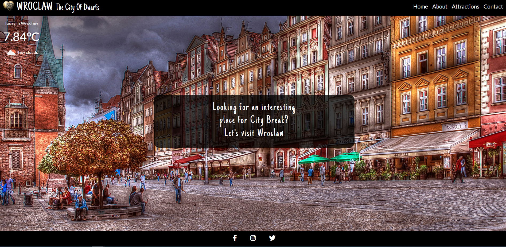
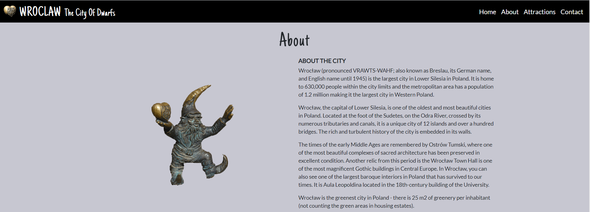

# Testing

- [Encountered Issues](#ecountered-issues)
- [Code Validation](#code-validation)
- [Testing User stories](#testing-user-stories)
- [Testing Functionality](#testing-functionality)
- [Testing Compatibility](#testing-compatibility)
- [Testing Accessibility](#testing-accessibility)
- [Testing Performance](#testing-performance)
- [Further Testing](#further-testing)

## Encountered Issues
---

**Project Bugs And solutions**
---
While working on this project I encountered the following problems which I tried to solve in the following way:

1. Issue with dwarf's array errors: When I tried to connect the buttons to the API map, the btn-dwarfs button showed 10 errors in the dev tool.
 The error appeared in an array where the lengths and widths were incorrectly defined, 
 instead of specifying lat and lng as an object had an additional location parameter that was not defined as specified in the code
- SOLUTION: removing the location: property from the array

2. Issue with broken links: Navbar didn't respond, it didn't move to each section when clicked on individual links.
 The error apeared because I implemented the solution to close dropdown menu after selecting link on navbar on small devices
  for from my previous project which worked perfectly on earlier version of bootstrap 4.6.
  bar would collapse after selecting the link on
 - SOLUTION: removing unnecessary code

3.  Issue with not collapsing the burger menu: after removing the solution to close dropdown menu from botstrap version 4.6
- SOLUTION: The solution was found on the Stack Overflow using a function in javascript to hide collapsible Bootstrap5 navbar on click.
4. Issue with API weather 401 error:  While testing the API weather, I noticed an 401 error displayed in google search when I tried to check the weather object for Wroclaw
`{
"cod": 401,
"message": "Invalid API key. Please see http://openweathermap.org/faq#error401 for more info."
}`. With the help of tutor support, an error was found and solved.

SOLUTION: The code I was using hardquoting quotes which were braking the url. It was changed using backticks. 
I also used a Math.floor function to round a temperature number to an integer.

5. Issue with Bootstrap version 5: Inintially I created  this project using Bootstrap version 5 as this is the newest version. However during
the development of the website I noticed issues with the navigation bar. Some problems like hide collapsible navbar on click 
I resolved using the javascript function which I found on stackoverflow. Unfortunatelly more issues appeared: navigationbar menu opened when the website loads and 
also when clicked on logo-brand. I wasn't sure how to proceed this issue. I tried to find the solution on the internet and also on the slack, given
solution did not bring the expected result. After talking to tutor support and advice, I changed the bootstrap to version 4.6 and used the navigation
bar from my previous project. This resulted in navigationbar menu working as intended.

## Code Validation
---
1. used [W3C Markup Validation Service HTML](https://validator.w3.org/) to validate my HTML code for both pages index.html and gallery.html. 

Initially, the validator displayed 2 warnings as shown below but these have been fixed.
- **Warning:** The type attribute is unnececary for Java Script rources

- FIXED - I found the solution on the website [webmasterworld](https://www.webmasterworld.com/javascript/4879097.htm)
to delete type attribute from the code: type="text/javascript"

2. used [jigsaw W3C CSS Validation Service](https://jigsaw.w3.org/css-validator//) to validate my CSS code, came out  clean

 but showed 1 error and 41 warnings related to Variables values and autoprefixer vendor extensions
- error : font-size Too many values or values are not recognized : 1,3rem on the line 31 have got removed
- warnings related to Variables values, research on the internet and found this is a non-issue after reading reports on [Stack Overflow](https://stackoverflow.com/questions/57661659/w3c-css-validation-parse-error-on-variables).
It is also requested feature on [Github](https://github.com/w3c/css-validator/issues/111) too.
- warnings related to unknown vendor extension i found thai is also non-issue after reading about it on different sources [Stack Overflow](https://stackoverflow.com/questions/52490004/what-are-all-of-these-w3c-css-validation-warnings-about)

3. used [jshint](https://jshint.com/) to validate javascript code for script.js 
### script.js testing
In the file script.js static analysis tool: jshint did not show any errors except 23 warnings, about:
-  6 missing semicolons in the code, which has been added to the code. 
- The other warnings were related to (use 'esversion: 6') or Mozilla JS extensions (use moz). 
I found the solution on the [stackoverflow](https://stackoverflow.com/questions/27441803/why-does-jshint-throw-a-warning-if-i-am-using-const)
that you should add a comment at the beginning of each js file `/*jshint esversion: 6 */` which worked.
- There was also one undefined bootstrap variable which was used for hide collapsible navbar on click in bootstrap5. I try to removed but after that code didnt work.

### maps.js testing
In the file maps.js static analysis tool: jshint did not show any errors as well, exept: 
 - 2 warnings about "Do not use 'new' for side effect".
 - 2 undefined variables: google and MarkerClusterer.
 - 3 unused variables: markerCluster, marker, initMap
No changes was made to these because the code have beed taken directly from the Google Maps JavaScrips API documantation and removing them or 
modify caused more errors.

### sendEmail.js testing
In the file sendEmail.js static analysis tool: jshint did not show any errors as well, exept:
- 1 undefined variable: emailjs.
- 1 unused variable: sendMail.
No changes was made to these because the code have been taken directly thom the documantetion for EmailJS

## Testing User stories
---
1.As a user, I want to navigate the site easily, so that I can find what I need effectively.
- No matter what page the user lands on, they can easily find and use navigation bar which also  is set fixed, being available all times.
- The logo image always leads back to the home page.

- The places on the map, when clicked, switch from one to the other without the need to close on the "x" tag

2. As a user, I want to be able to acces the website on a desktop and also mobile devices, so that I won't be restricted from which device I can access the site. 
- The website is responsive and tested on various devices as well as operating systems
- The footer is hidden on scrol to be able to display the larger website, expecially on smaller devices

3. As a user, I want to be able to follow or connect with the owner of the website on social media, so I can get more information about the city.
- Clearly labelled social media links displayed on the footer easy to find.   

4. As a user, I would like to know what the city has to offer, so that I can adjust it to my needs and interests.
- In the About page there is a short and concise not too overwhelming history of the city as well as its 
main attraction dwarfs.
- In the Attractions page includes the main attractions of the city, different kind of accommodation in 
various price ranges and restaurants/pubs/bars where there are served traditional Polish as well as these standard dishes and also localization and 
a little description about dwarfs
- An animated gallery with pictures of some dwarfs has been added to the website to give a user/futur visitor example of little dwarfs

5. As a user, I want to have an access to the map of the city with various places, so I can visually see their location.   
- On the Attractions page there is a map with 4 buttons: Attractions button, Food&Drinks button, Accomodation button, Dwarf's button with selected places for each button.
When pressed on each button, it shows their location on the map with a name of the place and the short description.

6. As a user, I want to be able to contact the site owner, so I will be able to share my feetback regardling the website or ask about planning my visit and get some more advice and recomendations.
- On the contact page there is a contact form which user can fill in send. The contact form is connected using EmailJS servics which allows users
to send their email directly without using the server. Iit was used the allert as interactive custom modal popup window when a usersubmits a contact form.
Depending on if the user puts data in the form it will display success or error note.

7.  As a user, I want to easily understand the purpose of this site.
  - When user lands on the website the jumbotron welcome sign describes the website's purpose 

## Testing Functionality

### Checking for broken links
---

### Responsive Design
---

 **Encountered problems while testing the site on different devices**
 ---

## Testing Compatibility
---

## Testing Performance
---

## Testing Accessibility
----

## Further Testing

### Overflow

