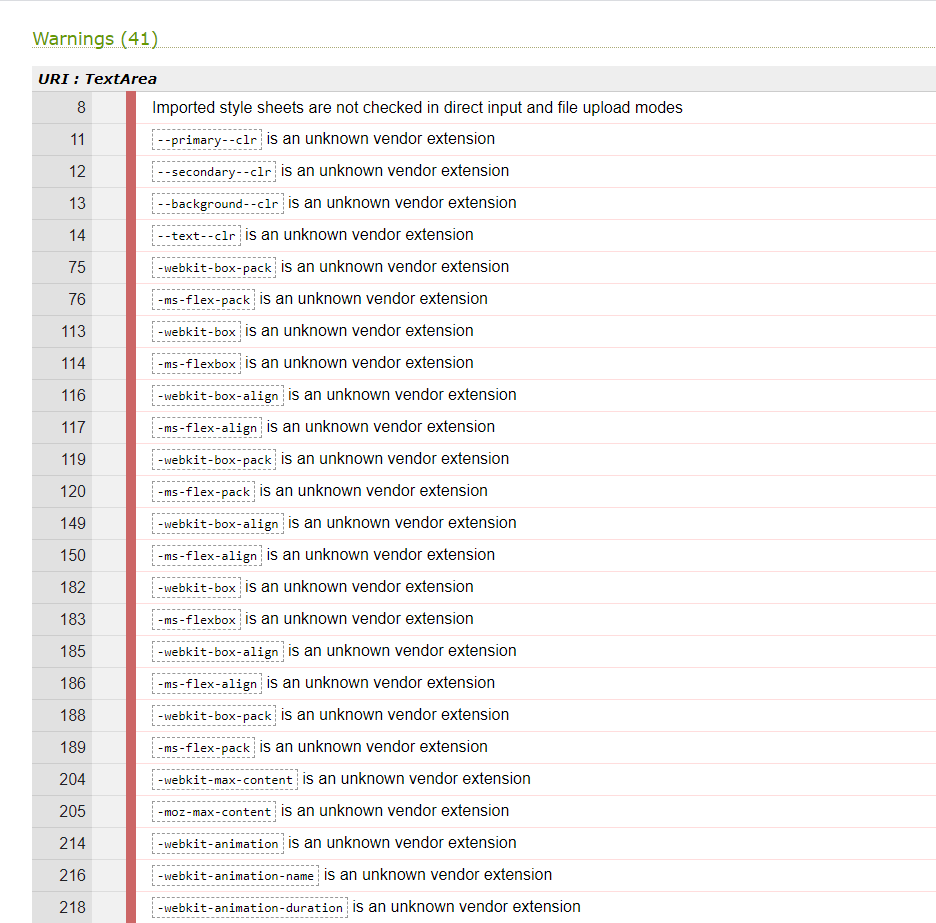
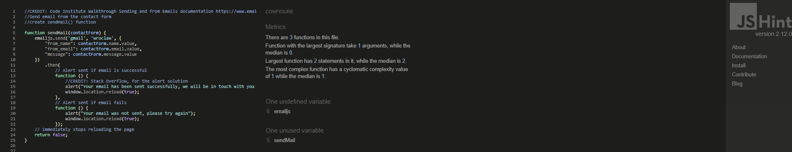
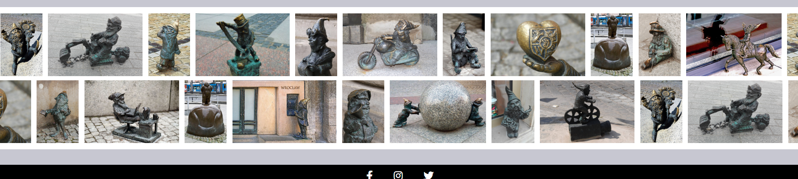
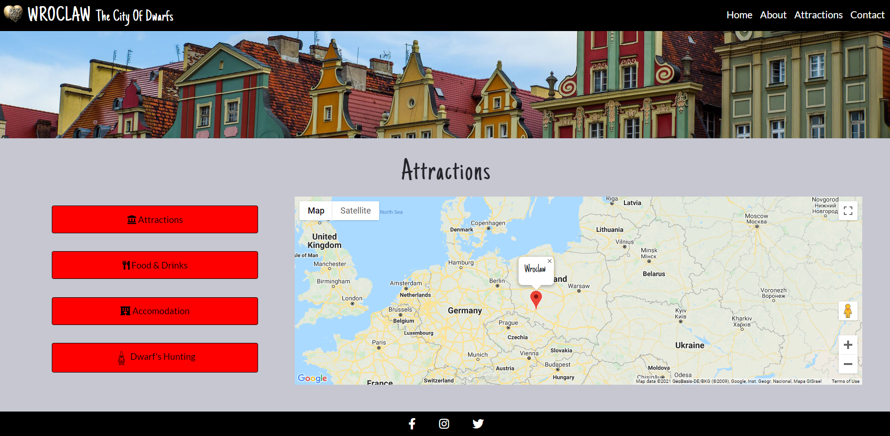
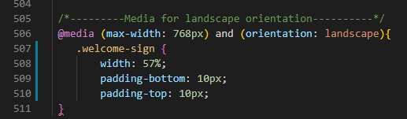

# Testing

- [Encountered Issues](#ecountered-issues)
- [Code Validation](#code-validation)
- [Testing User stories](#testing-user-stories)
- [Testing Functionality](#testing-functionality)
- [Testing Compatibility](#testing-compatibility)
- [Testing Accessibility](#testing-accessibility)
- [Testing Performance](#testing-performance)
- [Further Testing](#further-testing)

## Encountered Issues
---

**Project Bugs And solutions**
---
While working on this project I encountered the following problems which I tried to solve in the following way:

1. Issue with dwarf's array: When I tried to connect the buttons to the API map, the "btn-dwarfs" button showed 10 errors in the dev tool.
 The error appeared in an array where the lengths and widths were incorrectly defined, 
 instead of specifying lat and lng as an object had an additional location parameter that was not defined as specified in the code
- SOLUTION: removing the location: property from the array

2. Issue with broken links: Navbar didn't respond, it didn't move to each sections when clicked on individual links.
  The error appeared because I've implemented the solution to close dropdown menu after selecting link on navbar on small devices
 which worked perfectly on earlier version of bootstrap 4.6 but did not work on bootstrap version 5.
 - SOLUTION: removing unnecessary code

3.  Issue with not collapsing the burger menu: after removing the solution to close dropdown menu from bootstrap version 4.6
- SOLUTION: The solution was found on the Stack Overflow using a function in javascript to hide collapsible Bootstrap5 navbar on click.

4. Issue with API weather 401 error:  While testing the API weather, I noticed an 401 error displayed in google search when I tried to check the weather object for Wroclaw
`{
"cod": 401,
"message": "Invalid API key. Please see http://openweathermap.org/faq#error401 for more info."
}`. With the help of tutor support, an error was found and solved.

- SOLUTION: The code I was using was hardquoting quotes which were braking the url. The code was changed using backticks. 

I also used a Math.floor function to round a temperature number to an integer.

5. Issue with Bootstrap version 5: Inintially I created  this project using Bootstrap version 5 as this is the newest version. 
However during the development of the website I noticed issues with the navigation bar. Some issues like hide collapsible navbar on click 
I resolved by using the javascript function founded on stackoverflow. Unfortunatelly more issues appeared: navigation bar menu opened when the website loaded and 
also when clicked on logo-brand. I wasn't sure how to resolve this issue. I tried to find the answer to this on the internet and also on the slack, but unfortunatelly given
solution did not bring the expected result. After talking to tutor support and advice, I have changed the bootstrap 5 to version 4.6 and used the navigation
bar from my previous project. This resulted in navigation bar menu working as intended.

## Code Validation
---
1. used [W3C Markup Validation Service HTML](https://validator.w3.org/) to validate my HTML code for both pages index.html and gallery.html. 

Initially, the validator displayed 2 warnings as shown below but these have been fixed.
- **Warning:** The type attribute is unnececary for Java Script rources.

- FIXED - I found the solution on the website [webmasterworld](https://www.webmasterworld.com/javascript/4879097.htm)
to delete type attribute from the code: type="text/javascript"

2. used [jigsaw W3C CSS Validation Service](https://jigsaw.w3.org/css-validator//) to validate my CSS code, came out  clean

 but showed 1 error and 41 warnings related to Variables values and autoprefixer vendor extensions
- **Error**: font-size too many values or values are not recognized: 1,3rem on the line 31.
- FIXED - The code has been removed.
- **Warnings** related to Variables values, research on the internet and found this is a non-issue after reading reports on [Stack Overflow](https://stackoverflow.com/questions/57661659/w3c-css-validation-parse-error-on-variables).
It was also a requested feature on [Github](https://github.com/w3c/css-validator/issues/111) too.
- **Warnings** related to unknown vendor extension i found that is also non-issue after reading about it on different sources [Stack Overflow](https://stackoverflow.com/questions/52490004/what-are-all-of-these-w3c-css-validation-warnings-about)

3. used [jshint](https://jshint.com/) to validate javascript code for script.js 

### script.js testing
In the file script.js static analysis tool: jshint did not show any errors except 23 warnings, about:
-  6 missing semicolons in the code, which has been added to the code. 
- The other warnings were related to (use 'esversion: 6') or Mozilla JS extensions (use moz). 
I found the solution on the [stackoverflow](https://stackoverflow.com/questions/27441803/why-does-jshint-throw-a-warning-if-i-am-using-const)
that a comment `/*jshint esversion: 6 */` should be added at the beginning of each java script file which worked.
- There was also one undefined bootstrap variable which was used for hide collapsible navbar on click in bootstrap5. I tried to remove it but after that, code did not work. 
After change to bootstrap 4.6 the code for hide collapsible navbar was removed.

- Came out with no errors or warnings on the end of testing

### maps.js testing
In the file maps.js static analysis tool: jshint did not show any errors, except: 
 - 2 warnings about "Do not use 'new' for side effect".
 - 2 undefined variables: google and MarkerClusterer.
 - 3 unused variables: markerCluster, marker, initMap.
No changes was made to these because the code have been taken directly from the Google Maps JavaScrips API documantation and removing them or 
modify caused more errors.

### sendEmail.js testing
In the file sendEmail.js static analysis tool: jshint did not show any errors or warnings, except:
- 1 undefined variable: emailjs.
- 1 unused variable: sendMail.
No changes was made to these because the code have been taken directly from the documantetion for EmailJS.

## Testing User stories
---
1. As a user, I want to navigate the site easily, so that I can find what I need effectively.
- No matter what page the user lands on, they can easily find and use navigation bar which also is set fixed, being available all times.
- The places on the map, when clicked, switch from one to the other without the need to close on the "x" tag.
- The logo always leads back to the home page.

2. As a user, I want to be able to access the website on a desktop and also mobile devices, so that I won't be restricted from which device I can access the site. 
- The website is responsive and tested on various devices as well as operating systems.
- The footer is hidden on scroll to be able to display the larger website, expecially on smaller devices.
The Attractions page include the main attractions of the city, variious types of accommodation in 
various price ranges and restaurants/pubs/bars where traditional Polish food is served. There is also location and 
a little description about dwarfs.
- An animated gallery containing pictures of some dwarfs has been added to the website to give a user/future visitor example of little dwarfs.

5. As a user, I want to have an access to the map of the city with various places, so I can visually see their location.   
- On the Attractions page there is a map containing 4 buttons: Attractions button, Food&Drinks button, Accomodation button, Dwarf's button with selected places for each button.
When pressed on each button, it shows their location on the map with a name of the place and the short description.

6. As a user, I want to be able to contact the site owner, so I will be able to share my feedback regarding the website or ask about planning my visit 
and get some more advice and recomendations.
- On the Contact page there is a contact form which user can fill in and send. The contact form is connected using EmailJS service which allows users
to send their email directly without using the server. The alert is used as interactive custom modal popup window when a user submits a contact form.
Once the uses puts correct data in the form it will display success message 
"Your email has been sent successfully, we will be in touch with you as soon as possible" 
 or if there is a problem with sending the form then it will display an error message 
"Your email was not sent, please try again".

7.  As a user, I want to easily understand the purpose of this site.
  - When user lands on the website the welcome sign describes the website's purpose.
  - A hero image, placed on the home page gives a first glimpse on the website's content and purpose.
  - Strategically placed as logo name of the website also indicates what is the website's purpose.

## Testing Functionality

Comprehensive testing has been carried out. They are discussed in more detail in the table below:

### Checking for broken links
---
- A full screen overlay navigation is fully functional and responsive on different devices.
- All the nav links on the navigation bar goes to the expected section.
- When hover over each navigation link, it changes the color correctly.

### Responsive Design
---
- The website has been tested by using [Chrome DevTools](https://developers.google.com/web/tools/chrome-devtools) 
  and also on [Am I Responsive](http://ami.responsivedesign.is/) and [Responsinator](http://www.responsinator.com/) 
  on a number of devices with varying screen dimensions, for both portraits and landscape including iPhone 5/SE,
  iPhone 6/7/8, iPhone 6/7/8 plus, iPhone 11, iPad, iPad Pro, Moto G4, Galaxy S5, Surface Duo,
  Galaxy Fold, Widescreen Laptop and Desktop PC, iPad landscape · width: 1024px,  iPhone 6-8 Plump landscape 
· width: 736px ,iPhone 6-8 landscape · width: 667px, Android (Pixel 2) landscape · width: 684px, iPhone expensive landscape · width: 734px
      
- The website was also tested on real devices both portrait and landscape. The result on the other browsers was satisfying:
    - Samung Galaxy S6/S7/S8/S10/S20.
    - iPad Air.
    - iPhone 7.
    - Samsung Galaxy Tablet.

 **Encountered problems while testing the site on different devices**
 - Google Maps info window "Wroclaw" did not show on mobile devices. Initially, the info window was set to appear on the marker on mouseover, 
   since hoverstyles doesn't exist on touch devices this funcion didn't work.
   **Fixed:** by changing the `marker.addlistener` from `mouseover` to `click`.

 - For devices with landscape orientation the welcome sign on the Home section was too close together which was causing bad UX 
  **Fixed:** by adding media query for landscapes orientation.

## Testing Compatibility
---
The website was tested on the following browsers and operating systems:

- Google Chrome (Windows 10, Android 11, Linux).    
- Microsoft Edge (Windows 10).
- Safari.
- Firefox (Windows 10, Linux).
- Opera (Windows 10, Linux).
- Internet Explorer 11 was checked on [BrowserLing](https://www.browserling.com/).

    - Test for Opera browser
    

    - Test for Firefox browser
    

    - Test for Microsoft Edge browser
    
   
---
## Testing Performance
---
Performance has been tested using Lighthouse tool of Google Chrome. The results were a little different every time due to device performance and value estimation .
The results on the end were satisfying for desktop devices bit performance of mobile devices need to be reviewed and tested again.
There were some issues which caused the results like:
PERFORMANCE: 
- Properly sized images - all images has been resized in Photoshop and compressed in [TinyPNG](https://tinypng.com/)

BEST PRACTICES:
- Serves images with low resolution - applies to the PNG image that loads from the openweather API.

ACCESIBILITY:
- Background and foreground colors do not have a sufficient contrast ratio - checked color in [contrast checker](https://webaim.org/resources/contrastchecker/)
for `a.contact-details` in css.style and slightly change the color to meet the requirements.

- Usage of Aria-label showed: 
 in marker for "Wroclaw" on the map. 
I found on the  [web.dev](https://web.dev/semantics-and-screen-readers/#use-semantic-html) as best practice is use the element of `<button>`
than 
 with the attribute `role="button`. However I can't change it as this code was set by the google map API.

-  **Test for desktop devices**

- **Test for mobile devices**

## Testing Accessibility
----
The website's accessibility was also tested using Lighthouse. The test result was satysfying.

- **Accessibility for mobile devices on LightHouse**

- **Accessibility for desktop**

## Further Testing

### Overflow
- The website was tested for overflow using [Unicorn Revealer](https://chrome.google.com/webstore/detail/unicorn-revealer/lmlkphhdlngaicolpmaakfmhplagoaln?hl=en-GB) chrome extension. 
- Spelling was checked thoroughly using [Grammarly](https://app.grammarly.com/) extension and [online-spellcheck](https://www.online-spellcheck.com/)

